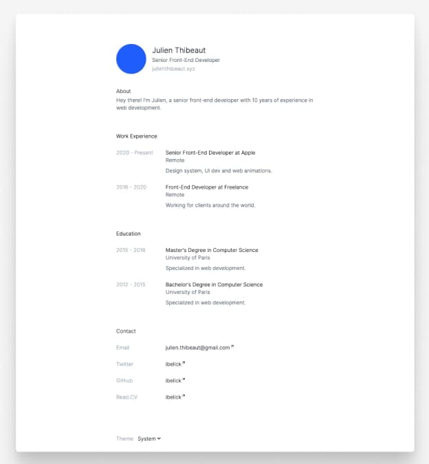

# Next.js Resume Template

This is a free, open-source resume template inspired by [read.cv](https://read.cv/). It's built with [Next.js 13](https://nextjs.org/), [Tailwind CSS](https://tailwindcss.com/), and [TypeScript](https://www.typescriptlang.org/). It also includes a dark mode and is optimized for SEO.

<p align="center">
    
</p>

## Features

- Next.js 13
- Tailwind CSS
- TypeScript
- Dark mode
- SEO optimized

## Getting Started

First, clone the repository and install the dependencies:

```bash
git clone https://github.com/ibelick/nextjs-resume.git
cd nextjs-resume

npm install
# or
yarn install
# or
pnpm install
```

Then, run the development server:

```bash
npm run dev
# or
yarn dev
# or
pnpm dev
```

Open [http://localhost:3000](http://localhost:3000) with your browser to see the result.

You can start editing the page by modifying `app/page.tsx`. The page auto-updates as you edit the file.

This project uses [`next/font`](https://nextjs.org/docs/basic-features/font-optimization) to automatically optimize and load Inter, a custom Google Font.

## Learn More

To learn more about Next.js, take a look at the following resources:

- [Next.js Documentation](https://nextjs.org/docs) - learn about Next.js features and API.
- [Learn Next.js](https://nextjs.org/learn) - an interactive Next.js tutorial.

You can check out [the Next.js GitHub repository](https://github.com/vercel/next.js/) - your feedback and contributions are welcome!

## Deploy on Vercel

The easiest way to deploy your Next.js app is to use the [Vercel Platform](https://vercel.com/new?utm_medium=default-template&filter=next.js&utm_source=create-next-app&utm_campaign=create-next-app-readme) from the creators of Next.js.

Check out our [Next.js deployment documentation](https://nextjs.org/docs/deployment) for more details.
